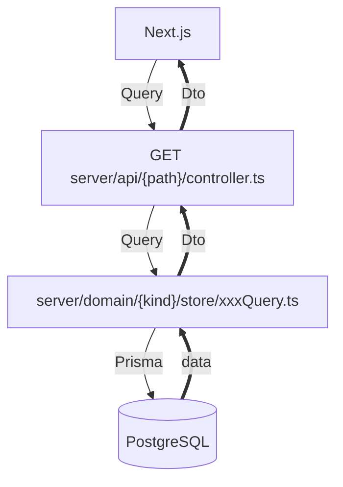
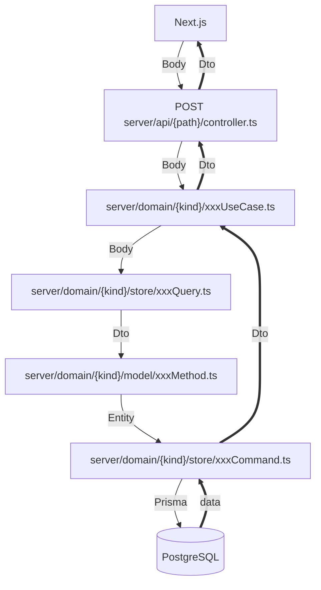

# C A T A P U L T

aspida と frourio を用いた FullStack TypeScript テンプレート

- Frontend: Next.js
- Backend: Fastify
- ORM: Prisma + PostgreSQL
- Auth: AWS Cognito
- Object Storage: AWS S3 or Cloudflare R2
- RESTではないHTTPリクエスト
- 関数型アーキテクチャ
- 全ての関数に依存性注入が可能
- 3rd Party Cookie なし
- Docker コンテナー1つだけでデプロイ
- ローカル開発は Node.js + Docker Compose で完結
- 最新コミットのデモ: https://catapult.frourio.com

### データ取得時のデータフロー



### データ更新時のデータフロー



## 開発手順

### Node.js のインストール

https://nodejs.org/en で v20 以上をインストール

### Gitリポジトリのクローン

```sh
$ git clone https://github.com/frouriojs/catapult.git
$ cd catapult
$ rm -rf .git # 既存のコミット履歴を削除
$ git init
```

### npm モジュールのインストール

package.json は3つ存在する

```sh
$ npm i
$ npm i --prefix client
$ npm i --prefix server
```

### 環境変数ファイルの作成

```sh
$ cp client/.env.example client/.env
$ cp server/.env.example server/.env
```

### Docker compose起動

```sh
$ docker compose up -d
```

### 開発サーバー起動

次回以降は以下のコマンドだけで開発できる

```sh
$ npm run notios
```

Web ブラウザで http://localhost:3000 を開く

開発時のターミナル表示は [notios](https://github.com/frouriojs/notios) で制御している

[Node.js モノレポ開発のターミナルログ混雑解消のための新作 CLI ツール notios](https://zenn.dev/luma/articles/nodejs-new-cli-tool-notios)

閉じるときは `Ctrl + C` を 2 回連続で入力

### ローカルでのアカウント作成方法

Docker の Inbucket に仮想メールが届くため任意のメールアドレスでアカウント作成可能

検証コード含めて開発時のメールは全て http://localhost:2501 のヘッダー中央の「Recent Mailboxes」に届く

## デプロイ

- `Dockerfile` でデプロイ可能

### データベース

`PostgreSQL`

### デプロイ検証済みPaaS

- [Render](https://render.com)
- [Railway](https://railway.app)

### 外部連携サービス

- AWS Cognito
- AWS S3 or Cloudflare R2

ヘルスチェック用エンドポイント

`/api/health`

### Dockerfile を用いたデプロイ時の環境変数

```sh
NEXT_PUBLIC_COGNITO_USER_POOL_CLIENT_ID=
NEXT_PUBLIC_COGNITO_USER_POOL_ID=
NEXT_PUBLIC_COGNITO_POOL_ENDPOINT=
COGNITO_ACCESS_KEY=
COGNITO_SECRET_KEY=
COGNITO_REGION=
DATABASE_URL=
S3_ACCESS_KEY=
S3_BUCKET=
S3_ENDPOINT=
S3_REGION=
S3_SECRET_KEY=
PORT= # optional
```

#### MinIO Console

http://localhost:9001

#### PostgreSQL UI

```sh
$ cd server
$ npx prisma studio
```
